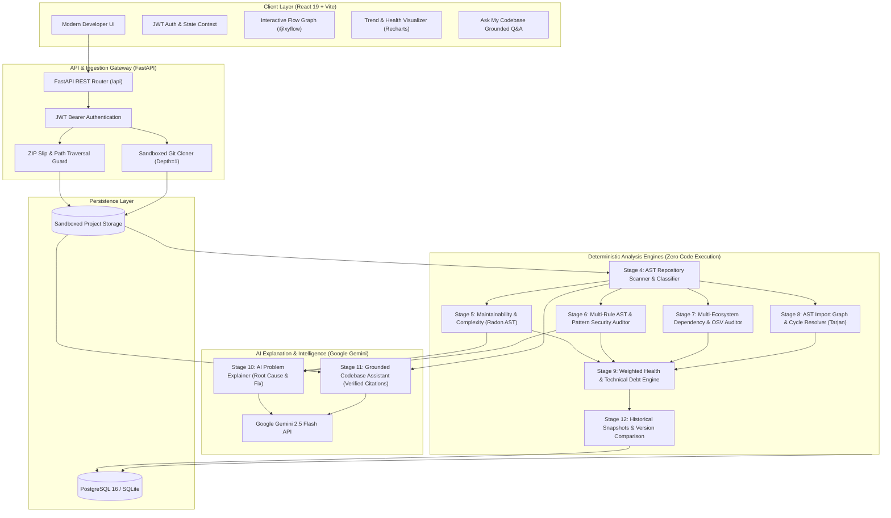

# Project Doctor — Intelligent Software Diagnostics & Codebase Intelligence Platform

[](https://github.com/arun17203/Project-Doctor/actions)
[](https://fastapi.tiangolo.com)
[](https://react.dev)
[](https://www.typescriptlang.org/)
[](https://www.docker.com/)
[](https://opensource.org/licenses/MIT)
[](https://vercel.com/new/clone?repository-url=https%3A%2F%2Fgithub.com%2Farun17203%2FProject-Doctor)
[](https://render.com/deploy?repo=https://github.com/arun17203/Project-Doctor)
[](https://project-doctor-one.vercel.app)
[](https://project-doctor-api.onrender.com)

**Project Doctor** is a production-grade, multi-stage static analysis and codebase intelligence platform. Designed as a "Doctor for Software," it diagnoses repository health, detects security vulnerabilities, audits software dependencies against public advisories, maps module architecture and circular dependencies, estimates technical debt, and provides grounded AI explanations and contextual Q&A—all without ever executing user source code.

---

## System Architecture



---

## Key Capabilities (15 Stages)

| Stage | Feature | Implementation Details |
|---|---|---|
| **01–03** | **Foundation & Auth** | JWT HS256 tokens, Bcrypt password hashing, project lifecycle management. |
| **04** | **Repository Scanner** | Multi-language AST discovery, code/comment line counts, recursive file categorization. |
| **05** | **Code Quality Analyzer** | Radon cyclomatic complexity ($M > 10$), maintainability index ($MI$), duplicate pattern detection. |
| **06** | **Security Audit Engine** | AST + regex detection for hardcoded secrets, SQL injection, command injection, eval/exec, weak crypto. |
| **07** | **Dependency Auditor** | Parses `requirements.txt`, `package.json`, `Pipfile`, `pom.xml`; checks against Google OSV advisories. |
| **08** | **Architecture Graph** | Module dependency resolution across layers (API, Service, Data, Presentation); Tarjan's cycle detection. |
| **09** | **Health & Technical Debt** | Weighted health score ($0-100$), deterministic technical debt hour estimations, "Fix First" priority ranker. |
| **10** | **AI Problem Explainer** | Grounded explanations using Google Gemini; generates root cause, downstream impact, and copy-ready fix. |
| **11** | **Ask My Codebase Q&A** | Interactive AI assistant answering questions using strictly verified citations from repository AST files. |
| **12** | **Analysis History & Trends** | Immutable analysis snapshots over time, delta calculations ($\Delta$ Health, $\Delta$ Debt, $\Delta$ Issues), file diffs. |
| **13** | **Developer UI Polish** | Production dark theme with Tailwind CSS, responsive sidebars, interactive diagrams, keyboard shortcuts. |
| **14** | **Automated Testing** | 105 unit and integration tests (100% pass rate), ZIP slip security tests, Alembic clean DB tests, Vitest. |
| **15** | **Deployment & Docker** | Multi-stage Docker containers, non-root user execution, Render API deployment, Vercel SPA edge hosting. |
| **16** | **The Automated Prescription** | One-click unified Git `.patch` generator targeting verified vulnerabilities, complexity, and dependencies. |
| **17** | **Executive Audit & PDF** | Printable Medical Chart report with letter grades (A–F), OWASP compliance breakdown, and `@media print` export. |
| **18** | **CLI Companion** | Standalone command-line scanner (`python -m backend.app.cli scan <target_directory> --fail-under 80`) for local and CI/CD use. |

---

## Security Guarantees

1. **Zero Code Execution**: Uploaded and cloned code is analyzed exclusively through static source parsing, Abstract Syntax Trees (Python `ast`), and regular expressions. User code is **never** compiled, imported, or executed.
2. **ZIP Slip Protection**: Absolute paths, directory traversal payloads (`../../`), symlinks, and forbidden paths are strictly filtered and rejected during archive extraction.
3. **Repository Sanitization**: Ingested repositories have all `.git`, `.venv`, `node_modules`, and binary artifacts sanitized to prevent command injection and resource exhaustion.
4. **Secret Masking**: Sensitive tokens (passwords, private keys, authorization headers) are automatically redacted with `***REDACTED***` before display or dispatch to AI APIs.

---

## Quickstart Guide

### Option 1: Docker Compose (Recommended for Production & Evaluation)

Prerequisites: Docker and Docker Compose installed.

```bash
# 1. Clone repository
git clone https://github.com/your-username/project-doctor.git
cd project-doctor

# 2. Configure environment (optional, sensible defaults provided)
cp .env.example .env

# 3. Build and launch all services (Database, Backend, Frontend)
docker compose up -d --build

# 4. Access application
# Frontend UI: http://localhost
# Backend API & Swagger Docs: http://localhost:8000/docs
# Liveness Probe: http://localhost/health
```

### Option 2: Local Development Setup

#### Backend (Python 3.11+)

```bash
# 1. Create and activate virtual environment
cd backend
python -m venv venv

# Windows
.\venv\Scripts\activate
# Linux/macOS
source venv/bin/activate

# 2. Install dependencies
pip install -r requirements.txt

# 3. Run database migrations
cd ..
alembic upgrade head

# 4. Start FastAPI server
python -m uvicorn backend.app.main:app --reload --host 127.0.0.1 --port 8000
```

#### Frontend (Node.js 20+)

```bash
cd frontend
npm install
npm run dev
# Frontend runs at http://localhost:5173
```

---

## Running the Automated Test Suite

Project Doctor includes a comprehensive automated test matrix verifying security, analyzers, migrations, and UI components:

```bash
# Run complete backend pytest suite (95+ tests)
pytest backend/tests -v

# Run frontend Vitest suite
cd frontend
npm test

# Run frontend production build & TypeScript verification
npm run build
```

---

## Demonstration Fixture

A pre-packaged educational codebase with known defects is included in `demo_repository/`. You can zip this folder or import it into Project Doctor to immediately observe real-world diagnostics:

```bash
# Create zip of demo repository
# Windows PowerShell:
Compress-Archive -Path demo_repository/* -DestinationPath demo.zip
# Linux/macOS:
zip -r demo.zip demo_repository/
```

Upload `demo.zip` in Project Doctor to view detected vulnerabilities (SQL Injection, hardcoded AWS keys, MD5 hashing, circular import cycle, and cyclomatic complexity).

---

## Cloud Deployment & Production Live Links

Project Doctor is deployed on a decoupled, production-ready cloud architecture:

| Component | Platform | Live URL | Description |
|---|---|---|---|
| **Frontend Web App** | **Vercel** | [https://project-doctor-one.vercel.app](https://project-doctor-one.vercel.app) | React 19 + Vite SPA served on global Edge CDN |
| **Backend API Service** | **Render** | [https://project-doctor-api.onrender.com](https://project-doctor-api.onrender.com) | Containerized FastAPI + Uvicorn service |
| **Interactive API Docs** | **Render** | [https://project-doctor-api.onrender.com/docs](https://project-doctor-api.onrender.com/docs) | Swagger UI for exploring all REST endpoints |

### Instant Demo Access:
* **Sign In URL**: [https://project-doctor-one.vercel.app/login](https://project-doctor-one.vercel.app/login)
* **Email**: `developer@example.com`
* **Password**: `password123`
*(You can also register a new account on the Sign Up tab).*

### How the Architecture Works:
1. **Frontend Hosting (Vercel)**:
   - Configured via [`vercel.json`](vercel.json) to compile the React Vite SPA and serve it on Vercel's global CDN.
   - Transparently proxies `/api/(.*)` requests to the Render backend, providing zero-CORS communication without manual client-side configuration.
2. **Backend Service (Render)**:
   - Configured via [`render.yaml`](render.yaml) and [`backend/Dockerfile`](backend/Dockerfile) with Python 3.11-slim, non-root security execution, and dynamic `$PORT` binding.
   - Automatically initializes SQLite tables and pre-seeds the developer account on startup.
3. **CI/CD Pipeline (GitHub Actions)**:
   - Runs automated linting, Vitest tests, and the complete 105-test Pytest matrix on every push to `main`.


---

## License

This project is licensed under the MIT License — see the [LICENSE](LICENSE) file for details.
